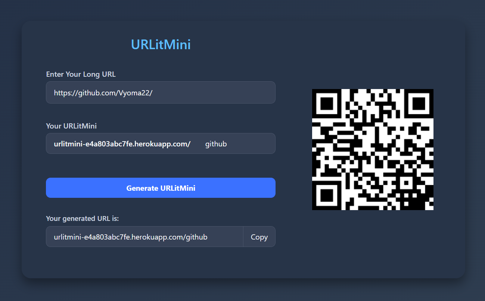

# URLitMini 🔗

**URLitMini** is a sleek and minimal URL shortener built with **React**, **Firebase**, and **Flask**, featuring custom alias creation and QR code generation.

🌐 **Live App**: [https://urlitmini-e4a803abc7fe.herokuapp.com](https://urlitmini-e4a803abc7fe.herokuapp.com)

---

## ✨ Features

- 🔗 Shortens long URLs to custom-friendly formats (`URLitMini.com/abc12`)
- ✍️ Option to define a **custom alias** for your link
- 🔍 Validates long URLs before shortening
- 📊 Prevents duplicates and stores all data in **Firebase Realtime Database**
- 📷 Auto-generates **QR codes** for each shortened link
- 📋 Easy copy-to-clipboard with tooltip feedback
- ⚡ Deployed backend using **Heroku**

---

## 🛠️ Tech Stack

### Frontend
- React (with Bootstrap)
- QR Code Generator (`qrcode.react`)
- URL validation (`valid-url`)

### Backend
- Python Flask
- Firebase Admin SDK
- Flask-CORS
- Hosted on Heroku

### Database
- Firebase Realtime Database

---

## 📸 Screenshots

| Home Page | QR Code |
|-----------|---------|
|  |  |

---

## 📚 How It Works

1. User enters a long URL and an optional preferred alias.
2. The form validates the URL and checks if the alias is available in Firebase.
3. If the alias is unique, a new shortened URL is saved to Firebase and returned.
4. A QR code is generated and displayed next to the result.
5. Users can copy the new link with a single click.

---

## 🚀 Deployment

- **Frontend** can be hosted via GitHub Pages, Netlify, or Vercel.
- **Backend** is deployed on [Heroku](https://heroku.com) with Flask.
- Firebase stores and serves the shortened URL mappings.

## 📜 License

MIT License © 2025 Vyoma Shah
